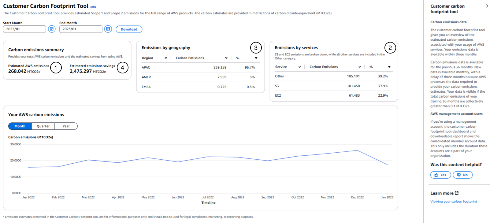

# Experimental programmatic access to the AWS Customer Carbon Footprint Tool data

You can use the [AWS Customer Carbon Footprint Tool](https://aws.amazon.com/aws-cost-management/aws-customer-carbon-footprint-tool/) (CCFT) to view estimates of the carbon emissions associated with your AWS products and services. You can access the same AWS Customer Carbon Footprint Tool information by resembling the behavior of the console with this **experimental** script.

The script can be used for programmatic access to the same AWS Customer Carbon Footprint Tool data the browser has access to. It enables customers to do two things: 
1. Programmatic access to feasibly get individual estimates of hundreds or thousands of accounts without logging in to each account manually.
2. Lowered carbon reporting threshold to kilogram level (three decimal digits) as introduced in the [CSV file download feature](https://aws.amazon.com/blogs/aws-cloud-financial-management/increased-visibility-of-your-carbon-emissions-data-with-aws-customer-carbon-footprint-tool/).

This repository gives you supporting source code for two use cases:
1. If you are looking for a way to extract CCFT data for a small number of accounts on an ad-hoc basis, or want to include the script within your application, you can find the [`ccft_access.py`](./MultiAccountApplication/lambda-functions/4_extract_carbon_emissions/ccft_access.py) script itself in the [`MultiAccountApplication/lambda-functions/4_extract_carbon_emissions/`](./MultiAccountApplication/lambda-functions/4_extract_carbon_emissions/) folder. To get started, check out the [General FAQs](#general-faq) and the [single-account specific FAQs](#single-account-script-faq) below.

2. If you are looking for a way to automate the monthly extraction of new CCFT data within a multi account structure, this repository contains source code and supporting files for a serverless application that you can deploy with the SAM CLI. With it, you can deploy an application to extract new AWS Customer Carbon Footprint Tool data every month for all accounts of your AWS organization with the experimental script. You can find the supporting source code within the folder [`MultiAccountApplication`](./MultiAccountApplication). To get started, check out the [General FAQs](#general-faq) and the [multi-account specific FAQs](#multi-account-extraction-faq) below.

Read the AWS Customer Carbon Footprint Tool documentation for more details to [understand your carbon emission estimations](https://docs.aws.amazon.com/awsaccountbilling/latest/aboutv2/ccft-estimation.html). 

## Security

See [CONTRIBUTING](CONTRIBUTING.md#security-issue-notifications) for more information.

## License

This library is licensed under the MIT-0 License. See the LICENSE file.

## FAQ

## General FAQ

### Q: What does experimental mean?

This script resembles the access to CCFT data from the AWS Billing Console. Hence it is not using an official AWS interface and might change at any time without notice and just stop working.

### Q: How does the data relate to what I see in the AWS Customer Carbon Footprint Tool?

On a high-level, the output from calling the experimental programmatic access script looks like the following. See the respective numbering in the screenshot of the AWS Customer Carbon Footprint Tool below to understand where you can find the respective information.
```bash
{
  "accountId": "████████████",
  "query": {
    "queryDate": <-- date when query was executed
    "startDate": <-- START_DATE of query
    "endDate": <-- END_DATE of query
  },
  "emissions": {
    "carbonEmissionEntries": [
      {
        "mbmCarbon": <-- (1), Your estimated carbon emissions in metric tons of CO2eq, following the market-based method (mbm) of the Greenhouse Gas Protocol 
        "paceProductCode": <-- (2), Your emissions by service
        "regionCode": <-- (3), Your emissions by geography
        "startDate": <-- month this data relates to
      },
      {
        […]
      }
    ],
    "carbonEmissionsForecast": <-- (5), Path to 100% renewable energy
      {
        […]
        "mbmCarbon": <-- Your estimated, forecasted carbon emissions in metric tons of CO2eq, following the market-based method (mbm) of the Greenhouse Gas Protocol
        "startDate": <-- year this data relates to
      },
      {
        […]
      }
    ],
    "carbonEmissionsInefficiency": <-- (4)
      {
        "gridMixInefficiency": <-- (4.1), Your emission savings from AWS renewable energy purchases
        […]
        "serverMedianInefficiency": <-- (4.2), Your emission savings from using AWS computing services
        "startDate": <-- month this data relates to
      },
      {
        […]
      }
    ]      
  […]
```


If your AWS Customer Carbon Footprint Tool emissions are zero, the script will also return `0.0`. Please note, that you will not see the product split in this case (`paceProductCode` under `carbonEmissionEntries`).

Read the AWS Customer Carbon Footprint Tool documentation for more details to [understand your carbon emission estimations](https://docs.aws.amazon.com/awsaccountbilling/latest/aboutv2/ccft-estimation.html).


## Single-account script FAQ

### Q: How do I use the script?

1. Clone the repository and navigate to the folder [`MultiAccountApplication/lambda-functions/4_extract_carbon_emissions/`](./MultiAccountApplication/lambda-functions/4_extract_carbon_emissions/).
2. [Assume](https://aws.amazon.com/premiumsupport/knowledge-center/iam-assume-role-cli/) a [role with access](#q-what-aws-iam-role-do-i-need) to the AWS Customer Carbon Footprint Tool.
3. Execute the script:

```bash
python ccft_access.py
```

```bash
{
    "accountId": "████████████",
    "query": {
        "queryDate": "2023-02-12", "startDate": "2020-01-01", "endDate": "2023-01-01"
    },
    "emissions": {
        "carbonEmissionEntries": [
            {
                "mbmCarbon": "0.048", "paceProductCode": "Other", "regionCode": "EMEA", "startDate": "2020-01-01"
            },
[…]
```

### Q: What AWS IAM role do I need?

Use a role with the following AWS IAM policy that contains the [AWS Customer Carbon Footprint Tool IAM permission](https://docs.aws.amazon.com/awsaccountbilling/latest/aboutv2/what-is-ccft.html#ccft-gettingstarted-IAM):

```json
{   
    "Version": "2012-10-17",
    "Statement": [
        {
            "Effect": "Allow",
            "Action": "sustainability:GetCarbonFootprintSummary",
            "Resource": "*"
        }
    ]
}
```

### Q: What python packages do I need?

You will need the python `requests` and `boto3` package. You can install it like this:

```bash
python -m pip install requests boto3
```

### Q: For what timeframe is data extracted?

New carbon emissions data is available monthly, with a delay of three months as AWS gathers and processes the data that's required to provide your carbon emissions estimates. By default, the script extracts data starting from 39 months ago until three months before the current month. 

Example: When you are running the script in July 2023, the script extracts carbon emissions data from April 2020 to April 2023. (start_date: 2020-04-01, end_date: 2023-04-01)

### Q: How can I change the queried timeframe?

Execute `python ccft_access.py -h` for help how the default interval can be changed. 

```bash
python ccft_access.py -h
```

```bash
usage: ccft_access.py [-h] [--start-date START_DATE] [--end-date END_DATE]

Experimental retrieval of AWS Customer Carbon Footprint Tool console data. The data
is queried for a closed interval from START_DATE to END_DATE (YYYY-MM-DD). The queried timeframe
must be less than 36 months and not before 2020-01-01.

optional arguments:
  -h, --help            show this help message and exit
  --start-date START_DATE, -s START_DATE
                        first month of the closed interval, default: 36 months before end month
  --end-date END_DATE, -e END_DATE
                        last month of the closed interval, default: 3 months before current month
```

### Q: How can I get the output prettyprinted?

You can use `jq` to prettyprint the JSON output. [jq](https://jqlang.github.io/jq/) is a lightweight and flexible command-line JSON processor. If you use pip use `pip install jq` to install it.


```bash
python ccft_access.py | jq .
```

```bash
{
  "accountId": "████████████",
  "query": {
    "queryDate": "2023-02-12",
    "startDate": "2020-01-01",
    "endDate": "2023-01-01"
  },
  "emissions": {
    "carbonEmissionEntries": [
      {
        "mbmCarbon": "0.048",
        "paceProductCode": "Other",
        "regionCode": "EMEA",
        "startDate": "2020-01-01"
      },
[…]
```

### Q: How do I get the data as a CSV?

You can extend the use of `jq` in [the previous question](#q-how-can-i-get-the-output-prettyprinted) to transform the JSON output to a CSV file.

```bash
python ccft_access.py | \
    jq -r '{accountId} as $account |
        .emissions.carbonEmissionEntries |
        map(. + $account ) |
        (map(keys) | add | unique) as $cols |
        map(. as $row | $cols | map($row[.])) as $rows |
        $cols, $rows[] | @csv' > ccft-data.csv

head ccft-data.csv
```

```bash
"accountId","mbmCarbon","paceProductCode","regionCode","startDate"
"████████████","0.048","Other","EMEA","2020-01-01"
[…]
```

## Multi-Account extraction FAQ

### Q: What does the application do on a high level?


The application does the following on a high level:
- On a monthly basis, an EventBridge schedule triggers a Step functions state machine
- If it gets invoked for the first time, a data backfill happens which extracts AWS Customer Carbon Footprint Tool data from the past 40-4 months for all of the accounts in your AWS organization
- The state machine checks if new monthly data is available (New data is available monthly, with a delay of three months) and retries daily if no new data is available yet
- An AWS Lambda function executes the script to extract data from the AWS Customer Carbon Footprint Tool for all accounts of your AWS organization
- The output is stored as a .json file in an S3 bucket
- An Athena table and view is created, which you can directly use to query the data or visualize it with Amazon QuickSight

### Q: What resources am I deploying?

This SAM template deploys the following resources:
- Two S3 buckets:
  - `{AccountId}-{Region}-ccft-data` bucket where your carbon emissions data is being stored
  - `{AccountId}-{Region}-athenaresults` bucket where your Athena results are stored
- Several Lambda functions with each a CloudWatch log group with retention time of 1 day and IAM roles with necessary permissions:
  - `get-account-ids.py` : returns all account ID's of an AWS organization as well as the payer account ID
  - `check-first-invocation.py` : checks if a backfill of data is needed in case of first invocation
  - `backfill-data.py`: invokes the ccft_access.py script for a specific account for the past 40-4months and stores the data as one .json file in the `ccft-data` bucket (example: `2020-03-01to2023-03-01carbon_emissions.json`)
  - `extract-carbon-emissions-data.py` : executes the experimental programmatic access script for a given account ID and stores it in the `ccft-data` bucket as a .json file (example: `2023-04-01carbon_emissions.json`)
  - `create-alter-athena-view.py` : creates an Athena database (if not exists) and an Athena table (if not exists), as well as creates or updates an Athena view which points to the `ccft-data` bucket
- An AWS Step Function State Machine `ExtractCarbonEmissionsStateMachine`. You can find the definition in statemachine/extract_carbon_emissions.asl.json
- An EventBridge scheduler `ExtractCarbonEmissionsFunctionScheduleEvent` as a trigger for the AWS Step Functions state machine which runs at the 15th day of every  month: cron(0 0 15 * ? *)
- An IAM role `ccft-sam-script-ExtractCarbonEmissionsFunctionSche-{id}` for the EventBridge scheduler

You can find details on the resources that are created within the [`template.yaml`](./MultiAccountApplication/template.yaml) file.

### Q: What does the state machine do?


(1) A Lambda function extracts all account ID's of the organization, as well as the payer account ID.

(2) The statemachine checks if it is invoked for the first time by checking if the created S3 bucket `{AccountId}-{Region}-ccft-data` is empty. If yes, it continues to (3). If there are already objects in the bucket (which means it is not the first invocation), it directly jumps to (4).

(3) The first invocation triggers a backfill of data for the past 40-4months.
  For every account that belongs to the organization you are running this in a Lambda function with the ccft script is triggered, which extracts the AWS Customer Carbon Footprint Tool data for the past 40 months to the past 4 months and stores it as one .json file per account in the ccft-data bucket, since the maximum duration that we can extract carbon emissions data from is 36 months. (Example: If the first invocation happens in August 2023, the script will extract data from April 2020 to April 2023). It then also creates an Athena database and table, as well as a view which unnests the .json data.

(4) As the publishing date for new monthly CCFT data can vary, the state machine first checks if there is data for the payer account ID available (for three months ago). If not, it goes to (5), if there is data available it goes to (6).

(5) If new monthly data is not yet available, the statemachine waits for one day and then tries (4) again.

(6) If new monthly data is available, we can continue to extract the data for all accounts of an AWS organization. The state machine extracts triggers a Lambda function with the ccft-script to extract CCFT data for all account ID's, and stores the data within one .json file.

(7) In the first invocation, an Athena database and table are created that point to the ccft-data bucket (in the case that this didn't happen yet in the backfill step). For every invocation, a view gets updated with the new data.

### Q: How can I deploy the application?

The Serverless Application Model Command Line Interface (SAM CLI) is an extension of the AWS CLI that adds functionality for building and testing Lambda applications. 

To use the SAM CLI, you need the following tools.

* SAM CLI - [Install the SAM CLI](https://docs.aws.amazon.com/serverless-application-model/latest/developerguide/serverless-sam-cli-install.html)
* [Python 3 installed](https://www.python.org/downloads/)
* Docker - [Install Docker community edition](https://docs.docker.com/get-docker/)

(1) Clone the repository.

(2) Navigate to the cloned repository and the folder `MultiAccountApplication`, so that you are in the folder that includes the [`template.yaml`](./MultiAccountApplication/template.yaml) file.
To build and deploy your application for the first time, run the following commands:

```bash
sam build
sam deploy --guided --profile <specify your profile name as in your credentials file our use default>
```

The first command will build the source of your application. If you get an error message related to Python 3.11 runtime dependencies, you can also use `sam build --use-container` to build your serverless application's code in a Docker container. 

The second command will package and deploy your application to AWS, with a series of prompts:

* **Stack Name**: The name of the stack to deploy to CloudFormation. This should be unique to your account and region. You can leave the default value of `ccft-sam-script`.
* **AWS Region**: The AWS region you want to deploy your app to.
* **CarbonEmissionsDataBucketName** parameter: Name suffix (w/o prefixes for acct ID, region) for carbon emissions data bucket.
* **CarbonEmissionsDataFileName** parameter: Name prefix for the .json file where carbon emissions data is stored.
* **CCFTRoleName** parameter: Name of the IAM role that was deployed into all member accounts and gives read access to the AWS CCFT data.
* **GlueDatabaseName** parameter: Name of the Glue database used for Amazon Athena.
* **Confirm changes before deploy**: If set to yes, any change sets will be shown to you before execution for manual review. If set to no, the AWS SAM CLI will automatically deploy application changes.
* **Allow SAM CLI IAM role creation**: This SAM template creates AWS IAM roles required for the AWS Lambda function(s) included to access AWS services. By default, these are scoped down to minimum required permissions. To deploy an AWS CloudFormation stack which creates or modifies IAM roles, the `CAPABILITY_IAM` value for `capabilities` must be provided. If permission isn't provided through this prompt, to deploy this example you must explicitly pass `--capabilities CAPABILITY_IAM` to the `sam deploy` command.
* **Save arguments to samconfig.toml**: If set to yes, your choices will be saved to a configuration file inside the project, so that in the future you can just re-run `sam deploy` without parameters to deploy changes to your application.

Confirm changeset to be deployed and wait until all resources are deployed. You will see a success message such as `Successfully created/updated stack - ccft-sam-script in eu-central-1`.

(3) Within the AWS console, navigate to the CloudFormation dashboard. Here, you will see the stack that was just deployed. You can navigate to the `Resources` tab to see all resources that were created as part of this stack.

(4) The state machine will automatically be triggered on the next 15th. If you want to run the application already now, you can also navigate to your `ExtractCarbonEmissionsStateMachine` Step Functions State Machine. Select **Start execution**. You can leave everything as is, and select **Start execution**. 

### Q: Into which account should I deploy this application?

You can run this from any account within your organization, as long as you set up the necessary permissions.

### Q: What permissions are needed to run this?

In order to successfully extract carbon emissions data from the central account for all child accounts, follow these steps:

(1) Deploy an IAM role named `ccft-read-role` with the following AWS IAM policy that contains the [AWS Customer Carbon Footprint Tool IAM permission](https://docs.aws.amazon.com/awsaccountbilling/latest/aboutv2/what-is-ccft.html#ccft-gettingstarted-IAM) into all child accounts. To do this for all accounts of your AWS organizations, there are several options which are explained in [Q: How can I deploy IAM roles into multiple accounts](#q-how-can-i-deploy-iam-roles-into-multiple-aws-accounts)

```json
{   
    "Version": "2012-10-17",
    "Statement": [
        {
            "Effect": "Allow",
            "Action": "sustainability:GetCarbonFootprintSummary",
            "Resource": "*"
        }
    ]
}
```

(2) Additionally, you need to set-up a trust relationship so that the central account (where you've deployed the SAM application) can assume this role. Update {Account} with the account ID of the central account where you've deployed this application.

```json
{
    "Version": "2012-10-17",
    "Statement": [
        {
            "Effect": "Allow",
            "Principal": {
                "AWS": "arn:aws:iam::{Account}:root"
            },
            "Action": "sts:AssumeRole",
            "Condition": {}
        }
    ]
}
```

(3) Optional: if you have given the IAM role a different name, you can change the parameter **CCFTRoleName** when deploying the SAM application. Make sure that all roles within all child accounts have the same name.

### Q: How can I deploy IAM roles into multiple AWS accounts?

Depending on your AWS Organization set-up, there are several ways to achieve having the same IAM role with a trust relationship deployed into all accounts of your AWS organization.

(1) In an AWS Control Tower environment, use the [Customization for Control Tower](https://aws.amazon.com/solutions/implementations/customizations-for-aws-control-tower/) (CfCT) CI/CD pipeline to deploy the CCFT read-only IAM role for existing and new accounts. A sample manifest and CFn template are included in the [`ccft-org-read-role`](./MultiAccountApplication/ccft-org-read-role/) folder in this repository.

(2) Using [AWS CloudFormation StackSets](https://docs.aws.amazon.com/AWSCloudFormation/latest/UserGuide/what-is-cfnstacksets.html) to deploy IAM roles to existing and future accounts. Check out the blog post [Use AWS CloudFormation StackSets for Multiple Accounts in an AWS Organization](https://aws.amazon.com/blogs/aws/new-use-aws-cloudformation-stacksets-for-multiple-accounts-in-an-aws-organization/) for more details. A sample template (`ccft-read-only.yaml`) for the role is included in the [`ccft-org-read-role/ccft-role`](./MultiAccountApplication/ccft-org-read-role/ccft-role/) folder in this repository.

### Q: Can I change the queried timeframe?
The application extracts data for three months past the month it is running. Example: The application extracts data for April 2023 when it runs in July 2023.
You can change the timeframe in the Lambda function [`4_extract-carbon-emissions/ccft-access-lambda.py`](./MultiAccountApplication/lambda-functions/4_extract_carbon_emissions/ccft-access-lambda.py) by changing `start_date` in line 40 and `end_date` in line 41. Format is `YYYY-MM-DD`.

### Q: What can I do with the data?
As a result of a successful run through the state machine, new emissions data from the AWS Customer Carbon Footprint Tool will be available monthly in the S3 bucket `{AccountId}-{Region}-ccft-data` in .json format.

To make it easier to use this data, the  state machine also creates an Athena table and view to directly query the data with SQL. Navigate to the Amazon Athena console and select the database **carbon_emissions**. You should see a table named `carbon_emissions_table` and a view called `carbon_emissions_view`. 


If you select **Preview Table** using the three dots next to your table, you can see the nested json data with one row per json file. You can also view the statement used to create the table by selecting **Generate table DDL** using the three dots next to your table.

Next, select **Preview view** using the three dots next to your view. When you select **Show/edit query** you can also see and modify the query to create the view. The view includes the unnested data, with one row per account and month data. You can use SQL statements to directly query the data. If you want to find all emissions for a specific month, you can for example use the following statement:
```sql
SELECT * FROM carbon_emissions_view WHERE startdate = '2022-01-01';
```

If you want to visualize the data, you can do so by using Amazon QuickSight. Check out the following documentation entry to understand [how you can create a QuickSight dataset using Amazon Athena data](https://docs.aws.amazon.com/quicksight/latest/user/create-a-data-set-athena.html).

### Other things to consider
- If you're logged in as a management account of AWS Organizations, the customer carbon footprint tool reports an aggregate of the member account data for the duration that those accounts were a part of your management account. If you're a member account, the customer carbon footprint tool reports emission data for all the periods for this account. This is regardless of any changes that might have occurred to your account's associated membership in one of the AWS Organizations. 
- If data isn't available for your account, your account might be too new to show data. After each month, you might have a delay of up to three months for AWS to show your carbon emission estimates.
- If the emissions of an account for a specific month are `0`, `paceproductcode` and `regioncode` will be empty in the Athena view.

###  What are costs for running this application?
The cost for running this application depends on the number of accounts that are part of your organization. You can use this [AWS Pricing Calculator example](https://calculator.aws/#/estimate?id=1963803b68ed07e959eb8cbd2b7b3a7059bbfbfb) and adapt it to your requirements. There are no upfront cost to running this application; you pay for the resources that are created and used as part of the application. Major services used are the following:

- [AWS Lambda](https://docs.aws.amazon.com/whitepapers/latest/how-aws-pricing-works/lambda.htmlaw): 
  - Example: If you have 100 accounts as part of your AWS organization, the first invocation (with backfill) will result in 205 Lambda function invocations, after the backfill 104 Lambda invocations per month (given that new AWS CCFT data is available on the 15th of the month). The `extract-carbon-emissions-data.py` and `backfill-data.py` Lambda functions run approximately 6-10 seconds per account ID.
- [AWS Step Functions](https://aws.amazon.com/step-functions/pricing/)
  - Example: The state machine will run once monthly, in the case of the backfill with 213 state transitions per month, or 110 state transitions after the backfill (given that new AWS CCFT data is available on the 15th of the month and the state machine run is successful).
- [Amazon S3](https://aws.amazon.com/s3/pricing/)
  - Example: The size of the backfill .json file is ~10KB, and the size of a .json file for one month's data ~1KB (note that this depends on the specific data you get back). Running the application for 100 AWS accounts, this would result in a total storage capacity for the first month of 1.1MB, with an additional 0.1MB per month.
- [Amazon Athena](https://aws.amazon.com/athena/pricing/)
  - Example: You run 10 queries a month and scan 100MB of data per query (note that this depends on the number of accounts of your AWS organization).

### Q: Cleanup - How can I delete the application?

To delete the sample application that you created, you can use the AWS CLI. Make sure to empty the buckets that were created as part of this application before you run the following command. Assuming you used `ccft-sam-script` for the stack name, you can run the following:

```bash
aws cloudformation delete-stack --stack-name ccft-sam-script
```
