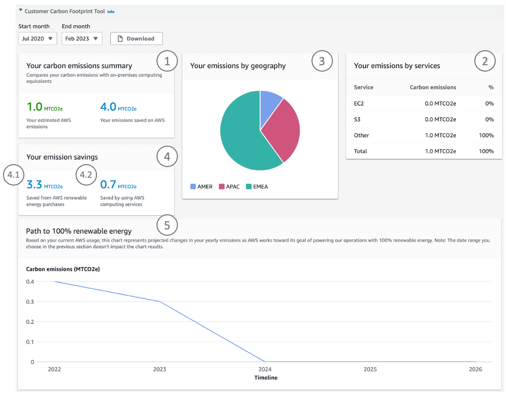

# Experimental programmatic access to the AWS Customer Carbon Footprint Tool data
You can use the [AWS Customer Carbon Footprint Tool](https://aws.amazon.com/aws-cost-management/aws-customer-carbon-footprint-tool/) to view estimates of the carbon emissions associated with your AWS products and services in the AWS Management Console. You can access the same AWS Customer Carbon Footprint Tool information by resembling the behavior of the console with this **experimental** script.

The script can be used for programmatic access to the same AWS Customer Carbon Footprint Tool data the browser has access to. It enables customers to do two things: 
1. Programmatic access to feasibly get individual estimates of hundreds or thousands of accounts without logging in to each account manually.
2. Lowered carbon reporting threshold to kilogram level (three decimal digits) as introduced in the [CSV file download feature](https://aws.amazon.com/blogs/aws-cloud-financial-management/increased-visibility-of-your-carbon-emissions-data-with-aws-customer-carbon-footprint-tool/).

Read the AWS Customer Carbon Footprint Tool documentation for more details to [understand your carbon emission estimations](https://docs.aws.amazon.com/awsaccountbilling/latest/aboutv2/ccft-estimation.html). 

## Security

See [CONTRIBUTING](CONTRIBUTING.md#security-issue-notifications) for more information.

## License

This library is licensed under the MIT-0 License. See the LICENSE file.

## FAQ

### Q: What does experimental mean?

This script resembles the access to AWS Customer Carbon Footprint Tool data from the AWS Billing Console. Hence it is not using a supported AWS interface and might change at any time without notice and just stop working.

### Q: How do I use the script?

1. Clone the repository and navigate to the root folder.
2. [Assume](https://aws.amazon.com/premiumsupport/knowledge-center/iam-assume-role-cli/) a [role with access](#q-what-aws-iam-role-do-i-need) to the AWS Customer Carbon Footprint Tool.
3. Execute the script:

```bash
python ccft_access.py
```

```bash
{
    "accountId": "████████████",
    "query": {
        "queryDate": "2023-02-12", "startDate": "2020-01-01", "endDate": "2023-01-01"
    },
    "emissions": {
        "carbonEmissionEntries": [
            {
                "mbmCarbon": "0.048", "paceProductCode": "Other", "regionCode": "EMEA", "startDate": "2020-01-01"
            },
[…]
```

### Q: What AWS IAM role do I need?

Use a role with the following AWS IAM policy that contains the [AWS Customer Carbon Footprint Tool IAM permission](https://docs.aws.amazon.com/awsaccountbilling/latest/aboutv2/what-is-ccft.html#ccft-gettingstarted-IAM):

```json
{   
    "Version": "2012-10-17",
    "Statement": [
        {
            "Effect": "Allow",
            "Action": "sustainability:GetCarbonFootprintSummary",
            "Resource": "*"
        }
    ]
}
```

### Q: What python packages do I need?

You will need the python `requests` and `boto3` package. You can install it like this:

```bash
python -m pip install requests boto3
```

### Q: For what timeframe is data extracted?

New carbon emissions data is available monthly, with a delay of three months as AWS gathers and processes the data that's required to provide your carbon emissions estimates. By default, the script extracts data starting from 39 months ago until three months before the current month. 

Example: When you are running the script in July 2023, the script extracts carbon emissions data from April 2020 to April 2023. (start_date: 2020-04-01, end_date: 2023-04-01)

### Q: How can I change the queried timeframe?

Execute `python ccft_access.py -h` for help how the default interval can be changed. 

```bash
python ccft_access.py -h
```

```bash
usage: ccft_access.py [-h] [--start-date START_DATE] [--end-date END_DATE]

Experimental retrieval of AWS Customer Carbon Footprint Tool console data. The data
is queried for a closed interval from START_DATE to END_DATE (YYYY-MM-DD). The queried timeframe
must be less than 36 months and not before 2020-01-01.

optional arguments:
  -h, --help            show this help message and exit
  --start-date START_DATE, -s START_DATE
                        first month of the closed interval, default: 36 months before end month
  --end-date END_DATE, -e END_DATE
                        last month of the closed interval, default: 3 months before current month
```

### Q: How does the data relate to what I see in the AWS Customer Carbon Footprint Tool?

On a high-level, the output from calling the experimental programmatic access script looks like the following. See the respective numbering in the screenshot of the AWS Customer Carbon Footprint Tool below to understand where you can find the respective information.
```bash
{
  "accountId": "████████████",
  "query": {
    "queryDate": <-- date when query was executed
    "startDate": <-- START_DATE of query
    "endDate": <-- END_DATE of query
  },
  "emissions": {
    "carbonEmissionEntries": [
      {
        "mbmCarbon": <-- (1), Your estimated carbon emissions in metric tons of CO2eq, following the market-based method (mbm) of the Greenhouse Gas Protocol 
        "paceProductCode": <-- (2), Your emissions by service
        "regionCode": <-- (3), Your emissions by geography
        "startDate": <-- month this data relates to
      },
      {
        […]
      }
    ],
    "carbonEmissionsForecast": <-- (5), Path to 100% renewable energy
      {
        […]
        "mbmCarbon": <-- Your estimated, forecasted carbon emissions in metric tons of CO2eq, following the market-based method (mbm) of the Greenhouse Gas Protocol
        "startDate": <-- year this data relates to
      },
      {
        […]
      }
    ],
    "carbonEmissionsInefficiency": <-- (4)
      {
        "gridMixInefficiency": <-- (4.1), Your emission savings from AWS renewable energy purchases
        […]
        "serverMedianInefficiency": <-- (4.2), Your emission savings from using AWS computing services
        "startDate": <-- month this data relates to
      },
      {
        […]
      }
    ]      
  […]
```


If your AWS Customer Carbon Footprint Tool emissions are zero, the script will also return `0.0`. Please note, that you will not see the product split in this case (`paceProductCode` under `carbonEmissionEntries`).

Read the AWS Customer Carbon Footprint Tool documentation for more details to [understand your carbon emission estimations](https://docs.aws.amazon.com/awsaccountbilling/latest/aboutv2/ccft-estimation.html).

### Q: How can I get the output prettyprinted?

You can use `jq` to prettyprint the JSON output. [jq](https://jqlang.github.io/jq/) is a lightweight and flexible command-line JSON processor. If you use pip use `pip install jq` to install it.


```bash
python ccft_access.py | jq .
```

```bash
{
  "accountId": "████████████",
  "query": {
    "queryDate": "2023-02-12",
    "startDate": "2020-01-01",
    "endDate": "2023-01-01"
  },
  "emissions": {
    "carbonEmissionEntries": [
      {
        "mbmCarbon": "0.048",
        "paceProductCode": "Other",
        "regionCode": "EMEA",
        "startDate": "2020-01-01"
      },
[…]
```

### Q: How do I get the data as a CSV?

You can extend the use of `jq` in [the previous question](#q-how-can-i-get-the-output-prettyprinted) to transform the JSON output to a CSV file.

```bash
python ccft_access.py | \
    jq -r '{accountId} as $account |
        .emissions.carbonEmissionEntries |
        map(. + $account ) |
        (map(keys) | add | unique) as $cols |
        map(. as $row | $cols | map($row[.])) as $rows |
        $cols, $rows[] | @csv' > ccft-data.csv

head ccft-data.csv
```

```bash
"accountId","mbmCarbon","paceProductCode","regionCode","startDate"
"████████████","0.048","Other","EMEA","2020-01-01"
[…]
```

### Q: Can I use this script within a AWS Lambda function?
Yes, you can. You can find an exemplary AWS Lambda function handler in the `lambda_function.py` file.

1. As the `requests` library is not included in the runtime, you need to add it to the AWS Lambda function.
Navigate to the cloned repository, create a directory, install the module in it and create a zip file with the following commands:
  ```
  mkdir package
  pip install --upgrade -r requirements.txt -t package
  cp ccft_access.py package
  cp lambda_function.py package
  cd package && zip -r ../package.zip .
  ```
2. Create a AWS Lambda function: Choose Python 3.10 as runtime. For architecture, you can use either x86_64 or arm64.
3. Upload the `package.zip` file to your AWS Lambda function. [You can deploy your .zip package using the AWS Lambda console, the AWS Command Line Interface, and the AWS Lambda API](https://docs.aws.amazon.com/lambda/latest/dg/python-package.html#python-package-create-update). 

    1. Using the console, select **Upload from** in the right corner of your **Code source** section
    2. Choose **.zip file**
    3. Select Upload, then select your `package.zip` file in the file chooser. This already includes the `ccft_access.py` script, as well as the `lambda_function.py` file with your AWS Lambda function handler.

4. You can modify the AWS Lambda function handler within `lambda_function.py`, to for example store the emissions output directly in Amazon S3. To do so, uncomment **line 44 & 45** and include your bucket name.
5. Make sure the execution role of the AWS Lambda function has [necessary permissions](#q-what-aws-iam-role-do-i-need). If you are directly storing the data to S3, make sure the AWS Lambda function has the correct access permissions (`s3:PutObject`) for the S3 bucket. You can find the execution role by navigating to the **Configuration** tab and selecting **Permissions** on the left. Select the execution role and add the necessary permission.
6. Change the timeout of your AWS Lambda function to 20 seconds. You can do this by navigating to the **Configuration** tab and selecting **Edit** under **General configuration**.
7. The provided AWS Lambda function handler extracts carbon emissions data from the AWS Customer Carbon Footprint tool for the account you are running the AWS Lambda function in. By default, the script extracts data starting from 39 months ago until three months before the current month. Therefore, you can test it with an empty (`{}`) test event.
